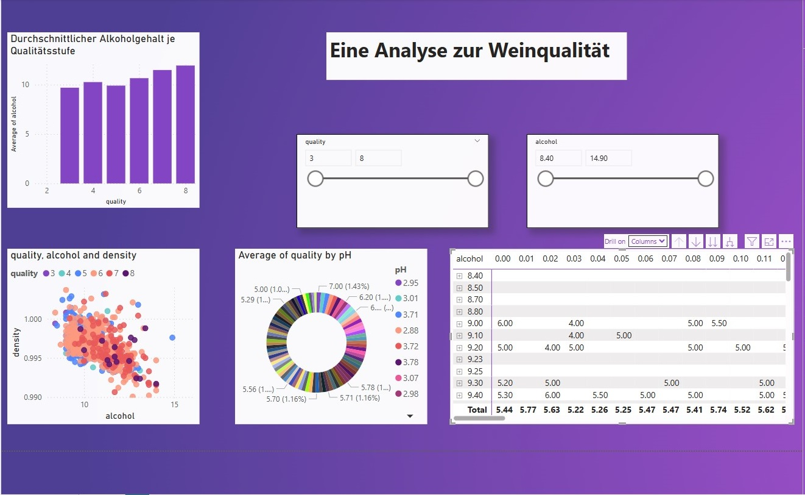

# Wine Quality Analysis 🍷

Data-driven analysis of wine quality using Python, Power BI, and Excel.

## Project Overview
This project analyzes red wine quality data to identify the chemical and physical properties that most influence wine ratings. The analysis combines Python, Power BI, and Excel for a full data-driven approach.

## Business Questions
- Which chemical properties have the strongest influence on wine quality?  
- How can producers optimize wine quality based on these insights?  
- Which features can be used for predictive modeling of wine quality?  

## Dataset
- `wine_quality_dataset.csv` – raw red wine dataset  
- Source: UCI Machine Learning Repository

## Tools & Technologies
- Python (Pandas, NumPy, Matplotlib, Seaborn)  
- Power BI  
- Microsoft Excel  
- Jupyter Notebook

## Analysis Workflow
1. Data exploration and cleaning  
2. Feature analysis and correlation analysis  
3. Visualization of quality drivers  
4. Predictive modeling using Python  
5. Dashboard creation for interactive exploration in Power BI and Excel  

## Key Insights
- Alcohol content shows a strong positive correlation with wine quality.  
- Volatile acidity negatively impacts quality ratings.  
- High-quality wines tend to have a balanced ratio of acidity and alcohol.  

## Recommendations
- Monitor and control alcohol and acidity levels during production.  
- Use predictive models to guide quality control and production decisions.  
- Focus on high-quality batches for premium marketing strategies.  

## Dashboards & Visualizations
- Quality distribution  
- Feature comparison by quality level  
- Correlation analysis  
- Interactive filters and slicers  

## Repository Structure
- `data/` – raw and cleaned datasets  
- `notebooks/` – Python analysis (Jupyter Notebook)  
- `media/` – Power BI dashboards, Excel analysis screenshots  
- `presentation/` – final project presentation (PDF/PowerPoint)

## Project Presentation
Full project presentation including Python analysis, Power BI dashboards, and Excel views:

📥 [Download Presentation (PDF)](Finale-Ahmadi.pdf)  

## Author
**Seyed Mohammad Hossein Ahmadi**  
Frankfurt am Main, Germany  

---

*Data Analysis Project | Certified Data Analyst | Python, Power BI & Excel*
